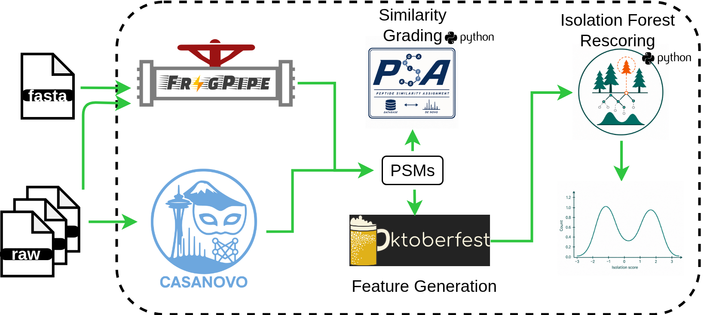

# grovems

A plain, installable Python package: Oktoberfest/Percolator rescoring -> PSA (peptide
similarity assignment) -> isolation-forest (IForest/SUOD) scoring, for the de novo sequencing.

## What it does

Five stages, each toggleable via `run_<stage>: true/false` in the config:
`rescoring` (Oktoberfest + Percolator, per branch) -> `psa` (merges the database/de novo
branches and grades shared-scan similarity) -> `iforest` (SUOD isolation-forest anomaly
scoring, independently per branch) -> `postprocess` (KS-test cutoffs, `GOOD`/`BAD` calls,
`good.csv`/`bad.csv`) -> `plotting` (optional extra QC plots). Full stage-by-stage detail,
including exact output files and columns, is in
[`docs/pipeline.md`](docs/pipeline.md).



## Quickstart

```bash
pip install -e .
cp assets/default_config.yaml my_config.yaml
# edit database_search_path / denovo_search_path / rawdata_path / outdir in my_config.yaml
# (or override them on the command line instead, as below)

grovems run --config my_config.yaml \
  --set database_search_path=/path/to/fragpipe/results \
  --set denovo_search_path=/path/to/casanovo/results \
  --set rawdata_path=/path/to/raw/mzml \
  --set outdir=/path/to/output
```

Any config value can be overridden per-run with `--set key=value` (repeatable) instead
of editing the file -- for example, `--set run_iforest=false` to skip the IForest stage.
Every stage's log output is both printed to stdout and appended to
`<outdir>/grovems.log`, and the fully-resolved config (input file + any `--set`
overrides applied) is written to `<outdir>/config.yaml` -- a permanent, self-contained
record of exactly what produced that run's output, independent of whatever `--set` flags
were used to launch it.

one-time setup is in [`docs/notes/installation.rst`](docs/notes/installation.rst).

## Cluster portability

- **Percolator**: provided externally, not a `pyproject.toml` dependency. Point
  `percolator_exe: /path/to/percolator` at a specific local install (default: bare
  `percolator`, resolved via `PATH`).
- **ThermoRawFileParser**: `thermo_exe: /path/to/ThermoRawFileParser.exe` points
  Oktoberfest at a local install (only relevant if it has to convert raw -> mzML itself;
  left unset, it falls back to its own per-platform default path).

## Key config values

See [`assets/default_config.yaml`](assets/default_config.yaml) for the full list,
defaults, and comments. Notable ones:

| Key                                                             | Default                                                                                     | Meaning                                                                                                                                                                                                                        |
| --------------------------------------------------------------- | ------------------------------------------------------------------------------------------- | ------------------------------------------------------------------------------------------------------------------------------------------------------------------------------------------------------------------------------ |
| `run_rescoring` / `run_psa` / `run_iforest` / `run_postprocess` | `true` / `true` / `true` / `true`                                                           | enable/disable each stage. `run_psa` requires `run_rescoring` in the same invocation; `run_postprocess` needs `ISO_scores` (from `run_iforest`, this invocation or an existing `grove_forest_dir`).                            |
| `run_plotting`                                                  | `false`                                                                                     | opt-in extra QC plots (Venn, Levenshtein, peptide length, percolator-vs-isolation-score); needs `ISO_scores_database`/`ISO_scores_denovo` (from `run_iforest`, this invocation or an existing `grove_forest_dir`)              |
| `database_oktoberfest_dir` / `denovo_oktoberfest_dir`           | `null` / `null`                                                                             | reuse an existing Oktoberfest output directory for that branch instead of running Oktoberfest (used in place); set one, both, or neither                                                                                       |
| `drop_columns_database`                                         | `lda_scores annotated_ions delta_mass_ppm log10_evalue next_score collision_energy_aligned` | columns dropped before training Percolator on the database pin                                                                                                                                                                 |
| `drop_columns_denovo`                                           | `lda_scores collision_energy_aligned`                                                       | columns dropped before scoring the de novo pin                                                                                                                                                                                 |
| `percolator_exe`                                                | `percolator`                                                                                | command/path used to invoke percolator (provided externally); point at an absolute path for a specific local install                                                                                                           |
| `percolator_module`                                             | `""`                                                                                        | environment module to load for percolator before `percolator_exe` runs; leave unset to skip module loading                                                                                                                     |
| `thermo_exe`                                                    | `null`                                                                                      | path to a local `ThermoRawFileParser.exe`; leave unset to use Oktoberfest's own default                                                                                                                                        |
| `num_threads` / `psa_max_workers` / `percolator_threads`        | `null` (-> `os.cpu_count()`) / `null` (-> `os.cpu_count()`) / `3`                           | worker/thread counts per stage; match these to your `#SBATCH --cpus-per-task` on a cluster                                                                                                                                     |
| `psa_max_raw_files`                                             | `null`                                                                                      | limit PSA to the first N raw files, for testing                                                                                                                                                                                |
| `iforest_features`                                              | [see file](assets/default_config.yaml)                                                      | SUOD feature columns to train/score on -- inlined here instead of a separate config file                                                                                                                                       |
| `overwrite_outputs`                                             | `false`                                                                                     | overwrite existing per-raw-file outputs (`merged/`, `grove_forest/`) instead of skipping raw files already processed                                                                                                           |
| `grove_forest_dir`                                              | `null`                                                                                      | only used when `run_psa: false` -- external `grove_forest/` directory for a standalone IForest and/or postprocess run (postprocess additionally needs it if `run_iforest: false` too, pointing at already-IForest-scored data) |
